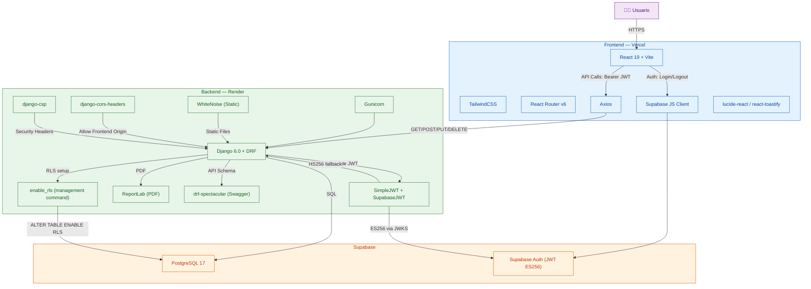
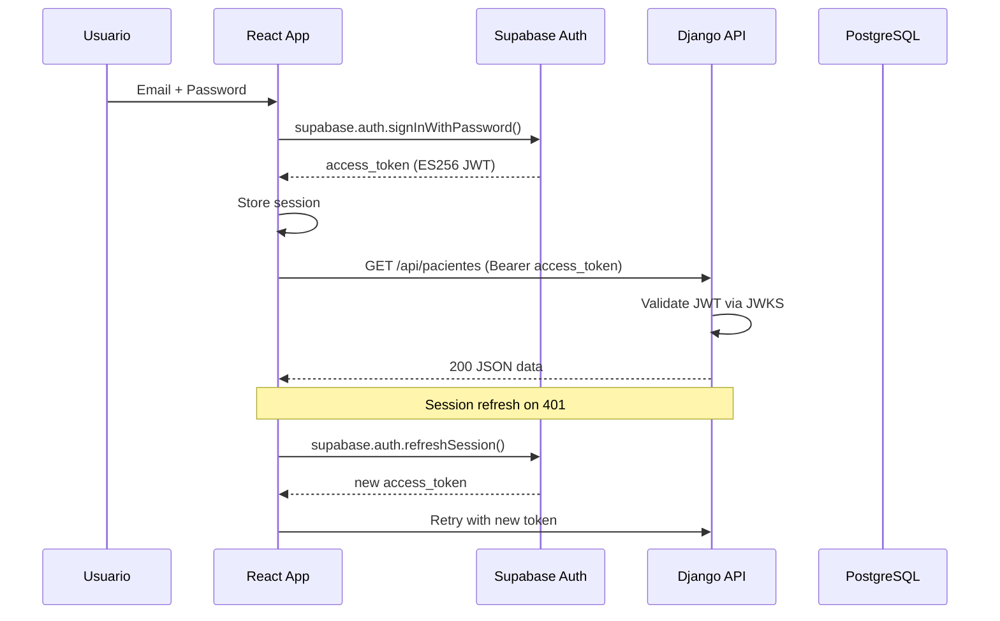

# Arquitectura del Sistema

## Flujo de Autenticación

## Seguridad Implementada

| Medida | Cómo |
|---|---|
| **RLS** | `enable_rls` command → `deny_all` policy on all public tables |
| **CORS** | `django-cors-headers` → solo `FRONTEND_URL` permitido |
| **CSP** | `django-csp` → scripts, styles, conexiones restringidas |
| **HSTS** | `Strict-Transport-Security: max-age=31536000` |
| **HTTPS** | `SECURE_SSL_REDIRECT` forzado en producción |
| **Cookies** | `SESSION_COOKIE_SECURE` + `CSRF_COOKIE_SECURE` + `HTTPONLY` |
| **Proxy SSL** | `SECURE_PROXY_SSL_HEADER` para Render |
| **JWT** | Dual auth: Supabase ES256 (via JWKS) + SimpleJWT HS256 fallback |
